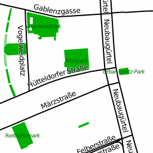
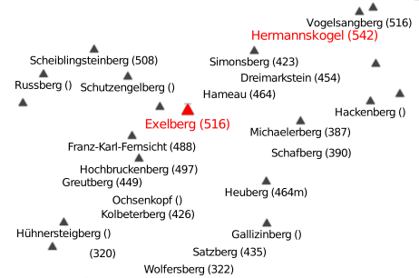
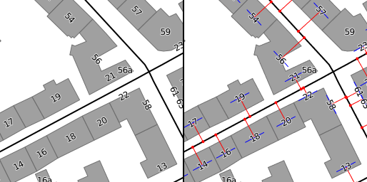
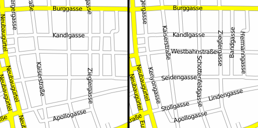
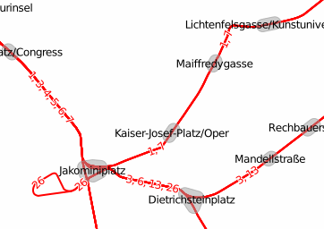

Major roads and parks
=====================
For starters a simple example will be shown: Major roads and parks.

&rarr; [Try it online!](http://pgmapcss.openstreetbrowser.org/?style=86f2f&zoom=15&lat=48.1993&lon=16.3374)


```css
/* draw a green polygon for all parks */
area[leisure=park] {
  fill-color: #00af00;

/* print a label on all parks */
  text: eval(tag(name));
  font-family: "DejaVu Sans";
  font-style: italic;
  font-size: 9;
  text-color: #005f00;
}

/* all major roads will be rendered with a 2px black line */
line|z12-[highway=primary],
line|z12-[highway=secondary],
line|z12-[highway=tertiary] {
  color: #000000;
  width: 2;

/* and a black label next to the line
   with a 50% transparent white halo */
  text: eval(tag(name));
  text-offset: 9;
  text-color: #000000;
  text-halo-color: #ffffff7f;
  text-halo-radius: 1;
  text-position: line;
}
```

Layering roads of a motorway junction
=====================================
pgmapcss automatically layers objects by its 'layer' tag, therefore the roads and bridges in the image automatically get layered correctly. You may force a specific layer by setting a property 'layer', e.g. area[landuse] { layer: -10; }.

&rarr; [Try it online!](http://pgmapcss.openstreetbrowser.org/?style=5a6da&zoom=15&lat=48.1207&lon=16.3241)


```css
line[highway=motorway],
line[highway=trunk] {
  width: 4;
  set .major_road;
}
line[highway=motorway_link],
line[highway=trunk_link] {
  width: 2;
  set .major_road;
}
line.major_road {
  linecap: round;
  color: #ff0000;
  casing-width: 1;
  casing-linecap: butt;
  casing-color: #707070;
}
line.major_road[bridge] {
  casing-color: #000000;
}
line.major_road[tunnel] {
  color: #ff7f7f;
  casing-dashes: 3,3;
}
```

Place nodes and their population
================================
In the 3rd example we see the places names of some villages and a simple
diagram with the population size. Also the administrative boundaries are shown.

&rarr; [Try it online!](http://pgmapcss.openstreetbrowser.org/?style=fc3ee&zoom=13&lat=46.8685&lon=15.7199)


```css
/* Print the name of all places */
point[place] {
  text: eval(tag(name));
  z-index: 2;
}

/* For each place show a diagram: a red circle depending on the
  population of the place. We are using the square root of population
  as pixel radius to not grow too fast. */
point[place]::diagram {
  geo: eval(buffer(prop(geo), sqrt(tag(population))));
  fill-color: #ff7f7f;
  color: #ff0000;
  width: 1;
}

/* Also, show administrative boundaries as purple lines */
line[boundary=administrative][admin_level<=8],
relation[boundary=administrative][admin_level<=8] {
  color: #7f00ff;
  width: 1;
  z-index: 1;
}
```

Highest Peaks
=============
The following map shows how to build relationships to "nearby" objects. Every
(mountain?) peak is compared to the surrounding peaks (with a distance of up to
128px) and if the peak is the highest it is highlighted.

&rarr; [Try it online!](http://pgmapcss.openstreetbrowser.org/?style=2956e&zoom=12&lat=48.2618&lon=16.2635)


```css
/* For every peak find all other peaks in a distance of max. 128px and
   build a list of the other peak's elevation in tag 'near_ele' */
node[natural=peak] near[distance<128] node[natural=peak] {
  set near_ele = eval(push(tag(near_ele), parent_tag(ele)));
}

/* For every peak calculate the max elevation of the nearby peaks and save in
   tag 'max_near_ele'. Write name and elevation on the peak. */
node[natural=peak] {
  set max_near_ele = eval(max(tag(near_ele)));
  text: eval(concat(tag(name), ' (', tag(ele), ')'));

/* For debugging you could uncomment the following row. It print the elevation
   of nearby peaks into a second second row. */
// text: eval(concat(tag(name), ' ', tag(ele), '\n(', join(tag(near_ele), ', '), ')'));
  z-index: 4;

  icon-image: triangle;
  icon-width: 12;
  text-offset: 8;
  point-text-layer: 3;
  icon-layer: 2;
}

/* if this is the highest peak of all neighbouring peaks OR the only peak,
   print name in red and in larger font. Also write name earlier to have higher
   preference (z-index). */
node[natural=peak][ele>=eval(tag(max_near_ele))],
node[natural=peak][!near_ele] {
  font-size: 14;
  text-color: red;
  z-index: 3;

  icon-image: triangle;
  icon-width: 18;
  icon-color: red;
  text-offset: 10;
  point-text-layer: 1;
  icon-layer: 0;
}
```

Housenumbers
============
Professional maps usually have the housenumbers rotated to be parallel to the associated street. The following mapcss file achieves this, by using an invisible line where the housenumber is printed on. The right image shows a "debug" view, where the construction of the "invisible" (here blue) line is shown. You can remove all statements marked with "DEBUG" from the mapcss file.


```css
/* Housenumbers get the value of tag 'addr:housenumber' printed on them */
point|z16-[addr:housenumber] {
  text-color: #000000;
  text-halo-color: #ffffffaf;
  text-halo-radius: 1;
  text: eval(tag(addr:housenumber));
  z-index: 4;
}

/* Highways will be shown with a black line */
line[highway] { z-index: 0; color: #000000; }
line[highway=primary],
line[highway=secondary],
line[highway=tertiary],
line[highway=residential] {
  width: 2px;
}
line[highway=unclassified],
line[highway=pedestrian] {
  width: 1.5px;
}
line[highway=service] {
  width: 1px;
}

/* Magic: all housenumbers in the vicinity (50px) of a highway get a class
   'has_highway' and the closest point on the highway near that housenumber
   will be calculated (as property 'geo' of pseudo element 'on_highway') */
line[highway] near[index=1][distance<50] point|z16-[addr:housenumber]::on_highway {
  geo: eval(line_interpolate_point(parent_geo(), line_locate_point(parent_geo(), prop(geo))));
  set .has_highway;
}

/* DEBUG: draw a red line between the housenumber and the 'on_highway' point */
point.has_highway|z16-::housenumber_to_on_highway {
  geo: eval(line(prop(geo, default), prop(geo, on_highway)));
  width: 1px;
  color: #ff7f7f;
  z-index: 1;
}

/* For housenumbers with class 'has_highway' a perpendicular vector to the line
   between the housenumber point and the 'on_highway' point with a length of
   30px is constructed. The housenumber is print on the line (text-position).
   */
point.has_highway|z16-[addr:housenumber] {
  geo: eval(rotate(line(
	translate(prop(geo), '15px', 0),
	translate(prop(geo), '-15px', 0)
      ),
      0-azimuth(prop(geo), prop(geo, on_highway))
    ));
  text-position: line;
}

/* DEBUG: draw a line where the housenumber gets printed on */
point.has_highway|z16-[addr:housenumber]::housenumber_line {
  geo: eval(prop(geo, default));
  color: #7f7fff;
  width: 1px;
  z-index: 2;
}

/* DEBUG: show a big dot on the 'on_highway' point */
point.has_highway|z16-::on_highway {
  geo: eval(buffer(prop(geo), 2px));
  fill-color: #af3f3f;
  z-index: 3;
}
```

Combining street parts
======================
Streets in OpenStreetMap are usually split into short junks to reflect changes in street layout: one way streets, bus routes, lanes, bicycles lanes, ... This raises a problem when rendering roads, as labels are missing (because they don't fit in a zoom level on the road) or are repeated at random intervals (when they just fit onto roads). pgmapcss 0.3 introduces 'combine', where features can be merged by statements.

In this example features are merged by either major/minor road type and their name. In the left image features are not merged. The change in the right image is clearly visible, much more roads can be labeled.

&rarr; Try it online: [original solution](http://pgmapcss.openstreetbrowser.org/?style=330ca&zoom=15&lat=48.1983&lon=16.3471), [combined roads](http://pgmapcss.openstreetbrowser.org/?style=a51b7&zoom=15&lat=48.1983&lon=16.3471)


```css
line|z8-[highway=motorway],
line|z10-[highway=motorway_link],
line|z8-[highway=trunk],
line|z10-[highway=trunk_link] {
  set .street_type = motorway;
}
line|z10-[highway=primary],
line|z10-[highway=primary_link],
line|z11-[highway=secondary],
line|z12-[highway=tertiary] {
  set .street_type = major;
}
line|z13-[highway=unclassified],
line|z15-[highway=residential] {
  set .street_type = minor;
}

line.street_type {
  casing-width: 1;
  casing-color: #a0a0a0;
}
line[.street_type=motorway] {
  width: 10;
  color: #ff7f00;
  z-index: 2;
}
line[.street_type=major] {
  width: 8;
  color: #ffff00;
  z-index: 1;
}
line[.street_type=minor] {
  width: 6;
  color: #ffffff;
  z-index: 0;
}

/* This is where the magic happens: At type 'street' is introduced
   which combines all lines with an equal 'street_type' tag (which
   is set in the statements above) and the same name. */
line.street_type[name] {
  combine street eval(concat(tag(street_type), '-', tag(name)));
}

/* merge lines if possible; print name */
street {
  geo: eval(line_merge(prop(geo)));
  text: eval(tag(name));
  text-position: line;
  text-spacing: 256;
  layer: 10;
  z-index: 1;
}
```

Tramway network
===============
A route map of all tramway routes (and other means of transportation, but this should just be a simple example) should show all route references on their ways nicely sorted.

Also most stations consist of many individual stops for all the busses and trams going in different directions, but on the map we want to print the name only once.

This is something that usually needs quite some database magic, but can be achieved with some pgmapcss magic.

&rarr; [Try it online!](http://pgmapcss.openstreetbrowser.org/?style=dc018&zoom=15&lat=47.0691&lon=15.4468)


```css
/* Draw all tram routes in red */
line[route=tram] {
  color: #ff0000;
  width: 2;
}

/* For every route iterate over all members to save their 'ref' tag
   to the child tag 'ref_list' */
relation[route=tram] > line|z14-[railway] {
  set ref_list = eval(push(tag(ref_list), parent_tag(ref)));
}

/* Remove duplicate refs from list, sort the list. Combine all lines
   with the same combination of routes into a new type 'tram_routes'. */
line|z14-[railway] {
  set ref_list = eval(sort(unique(tag(ref_list))));
  combine tram_routes eval(tag(ref_list));
}

/* Render the tram_routes from the statement before. "Line Merge" the
   geometry for nicer label placement. Sort the refs "naturally" and
   merge with a colon. Repeat labels every ~128px. */
tram_routes::label {
  geo: eval(line_merge(prop(geo)));
  text: eval(join(natsort(tag(ref_list)), ', '));
  text-color: #ff0000;
  text-halo-color: #ffffff;
  text-halo-radius: 1;
  text-position: line;
  text-spacing: 128;
  z-index: 3;
}

/* Find all tram stops on the map and combine them (with the same name - only
   if they have a name) to the new type 'tram_stop'. */
node|z14-[railway=tram_stop][name] {
  combine tram_stop eval(tag(name));
}

/* Build a polygon (a "convex hull") from all the tram stop nodes and
   draw a buffer of 7px around them. */
tram_stop {
  geo: eval(buffer(convex_hull(prop(geo)), 7px));
  fill-color: #a0a0a07f;
  width: 1;
  color: #a0a0a0af;
  z-index: 1;
}

/* Print the stop name on the polygon from the geometry of the "default"
   pseudo element (the statement above) */
tram_stop::label {
  geo: eval(prop(geo, default));
  text: eval(tag(name));
  z-index: 2;
}
```

Data: (c) [OpenStreetMap](http://www.openstreetmap.org) contributors.
